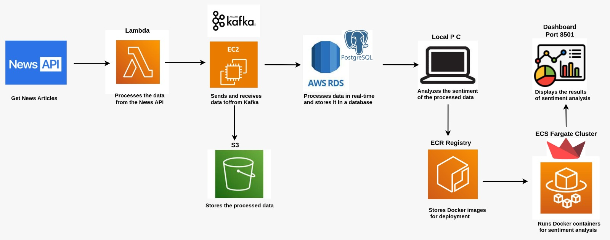

#  Real-Time News Data Pipeline

A real-time data engineering project that fetches live news data, streams it through Apache Kafka and Apache Spark, performs sentiment analysis, and stores it in a PostgreSQL database. Visual components and architecture are included for a comprehensive view.

---

##  Project Architecture

---

##  Tech Stack

- **Data Source**: [NewsAPI](https://newsapi.org/) – for fetching live headlines by country and category

- **Messaging/Streaming**: **Apache Kafka** – for real-time data ingestion and message queueing (hosted on EC2)

- **Raw Storage**: **Amazon S3** – for temporarily storing raw news data before processing

- **Stream Processing**: **Apache Spark Structured Streaming** – for real-time parsing, transformation, and enrichment

- **Sentiment Analysis**: **TextBlob** – to classify news headlines as Positive, Negative, or Neutral

- **Structured Storage**: **PostgreSQL (AWS RDS)** – to persist cleaned and labeled data for querying

- **Visualization**: **Streamlit** – for building an interactive UI to display news and sentiment

- **Deployment**:
  - **Docker** – to containerize the Streamlit application  
  - **Amazon ECR (Elastic Container Registry)** – to store container images  
  - **Amazon ECS (Fargate)** – for serverless deployment of the Streamlit app

- **Programming Language**: **Python**

---

## Pipeline Flow

1. **News API**  
   → Fetches live news headlines (e.g., from NewsAPI) based on country and category preferences.

2. **Kafka Producer (`producer.py`)**  
   → Sends the fetched news data as JSON messages to a Kafka topic (`news-topic`) running on an EC2 instance.

3. **Kafka Consumer (`Consumer.py`)**  
   → Reads messages from the Kafka topic and:
   - Stores the raw news data temporarily in an **S3 bucket**
   - Prepares data for stream processing

4. **Apache Spark Streaming (`streaming.py`)**  
   → Reads data from **Kafka** or **S3**
   - Parses and cleans the data
   - Performs **sentiment analysis** using `sentiment_analysis.py`
   - Writes the transformed, enriched news data into a **PostgreSQL database** hosted on **AWS RDS**

5. **PostgreSQL RDS**  
   → Stores the cleaned, structured news articles, including title, description, timestamp, and sentiment.

6. **Streamlit Dashboard**  
   → Connects to the PostgreSQL database
   - Visualizes the latest news headlines along with their **sentiment labels**
   - Provides a real-time UI to browse and analyze news content

7. **Deployment using ECS + ECR**  
   → The **Streamlit app** is containerized using Docker  
   - Pushed to **Amazon ECR (Elastic Container Registry)**  
   - Deployed on **Amazon ECS Fargate** for serverless, scalable hosting

